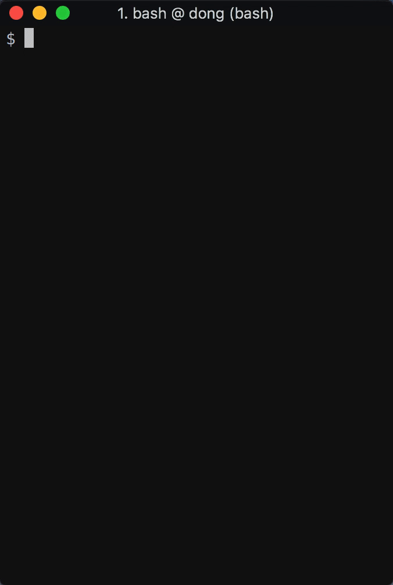

# twitch-chat-cli

> Read Twitch chat on your terminal

<p align="center">
	<br>
	
	<br>
	<br>
</p>

## Installation

```sh
$ npm install -g twitch-chat-cli
```

## Usage

First generate an [OAuth token](https://twitchapps.com/tmi/) to connect to the Twitch IRC.

Add your OAuth token:

```sh
$ tc add <username> <token>
```

Connect to a channel to start reading chat:

```sh
$ tc connect <channel-name>
```

## Emotes

This feature currently only works in [iTerm](https://www.iterm2.com/), which has support for displaying pictures.

To see Twitch emotes as pictures, you will need to have the API server running, which allows the CLI to query for global and channel specific emotes. You will need to have [Docker](https://www.docker.com/community-edition) installed to run the server.

You will need to have [Git LFS](https://github.com/git-lfs/git-lfs) installed.

First clone this repo:

```sh
$ git clone https://github.com/dongy7/twitch-chat-cli.git
```

Start the Docker containers from the `api` directory:

```sh
$ cd api
$ docker-compose up -d
```

The server should now be running at `http://localhost:3000/`.
